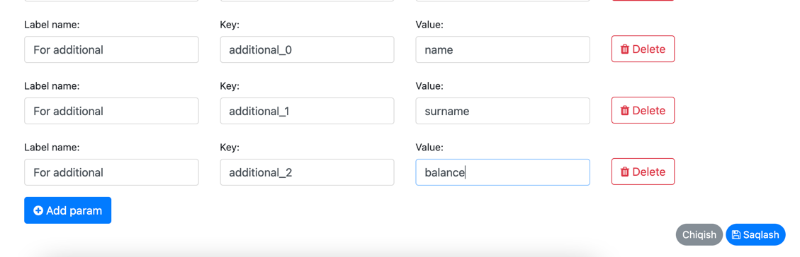

# Additional fields

With the feature you can retrieve any attributes of model.
For that you should define custom attributes in payment system configuration.  

For example:  

You should add key as "additional_***index***" and value "**attributeName**"



Function automatically retrieves these attributes of model in each specific methods in callback.
But only Click you should give API for additional attributes to Click admins.


# Case Click

You can give below API to click:

```text
url: yourDomain/payment/click/user-balance 
method: Get|Post // suggestion is Post
```
