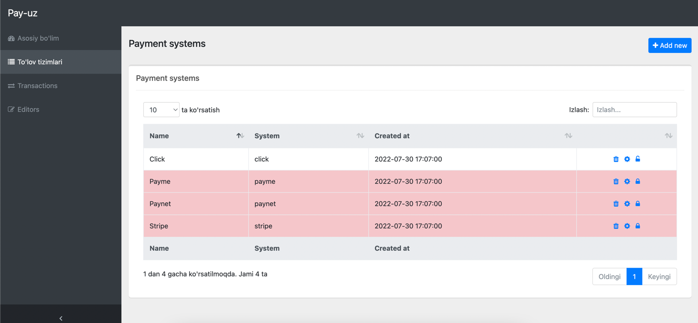
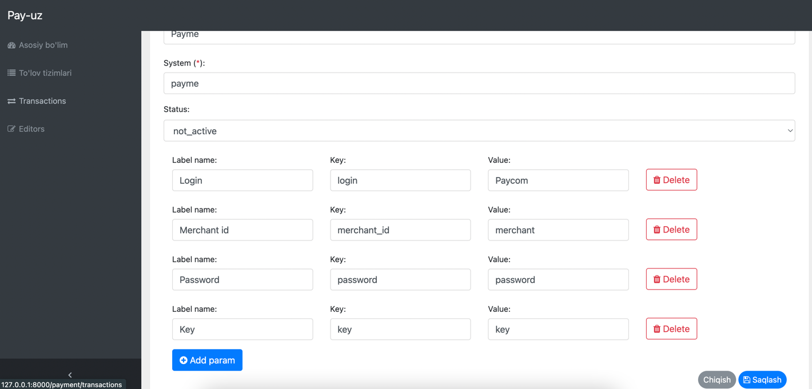

# Configurations

With the installation of Package you will find a new configuration file located at `config/payuz.php`.  
In this file you can find various options to change the configuration of your Voyager installation.

**If you cache your configuration files please make sure to run `php artisan config:clear` after you changed something.**

Below we will take a deep dive into the configuration file and give a detailed description of each configuration set.

## Payuz

```php
<?php

/*
 * You can place your custom package configuration in here.
 */
return [

    // Assets folder published folder name.

    'pay_assets_path' => '/vendor/pay-uz',
    'control_panel' => [
        'middleware' => null
    ],
    'multi_transaction' => true,

    'invoice_life_time' => 15, // minutes
];
```

## Set payment system keys in dashboard

Each payment system has own different keys which given by System. You should define them in their system configuration



For example (Payme):  
You should define 
* merchant_id, 
* password - it is called key in Payme,
* key - it is your model attribute for find model e.g. "user_id" or "id"


