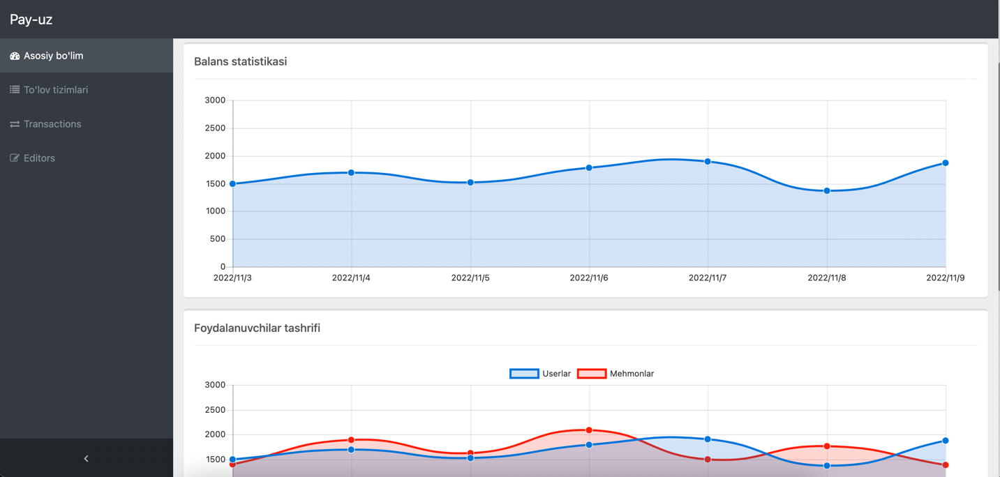

# Introduction

Welcome to the Laravel Payment Package documentation for version 2.1.7. This documentation will teach you how to install, configure.

# What is Laravel-Payment

Before installing Package it is very important to take a quick moment to learn what it is.

* A payment integration package with dashboard interface for your Laravel app
* An easy way to integrate payment systems for your app
* Covered working with invoices
* Automated routing

